# 🛠️ PromptForge

> A multi-persona AI assistant built with **Gradio** and **Groq**, featuring streaming responses, few-shot prompting, and structured JSON output.

PromptForge lets you chat with four unique AI personas, each with its own personality, prompting strategy, and response style. Switch between personas at any time to experience how system prompts and few-shot examples influence an LLM's behavior.

---

## ✨ Features

- 🎭 Four unique AI personas
- 🌊 Token-by-token streaming responses
- 🧠 Few-shot prompting for consistent personality
- 🌡️ Adjustable temperature slider
- 📜 Live view of the active system prompt
- 💻 Structured JSON output for code reviews
- 🔄 Automatic conversation reset when switching personas
- 🎨 Clean Gradio interface

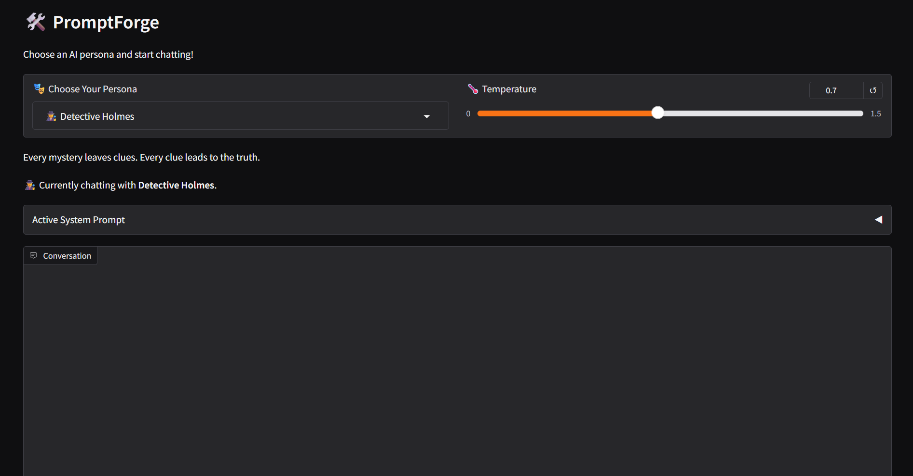

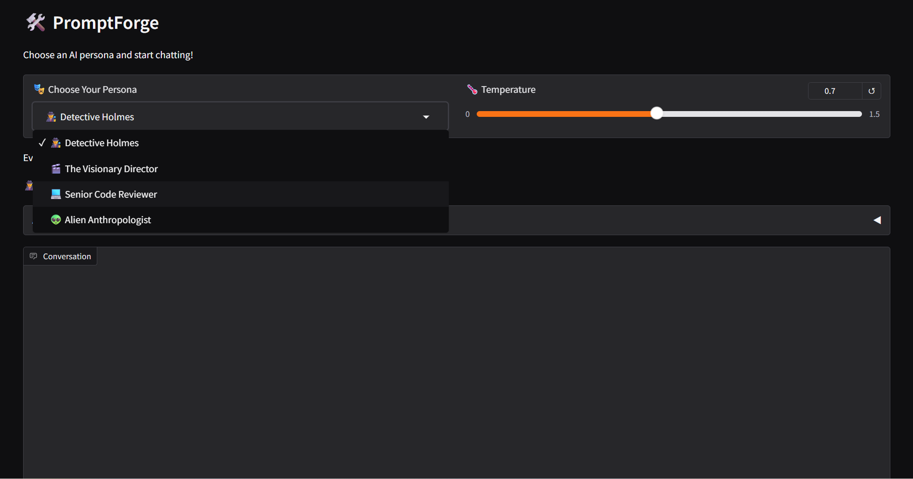

---

# 🎭 Personas

## 🕵️ Detective Holmes

Analyzes every conversation like a detective solving a mystery.

- Presents observations
- Makes logical deductions
- Maintains a classic detective tone

### 🖼️ Screenshots

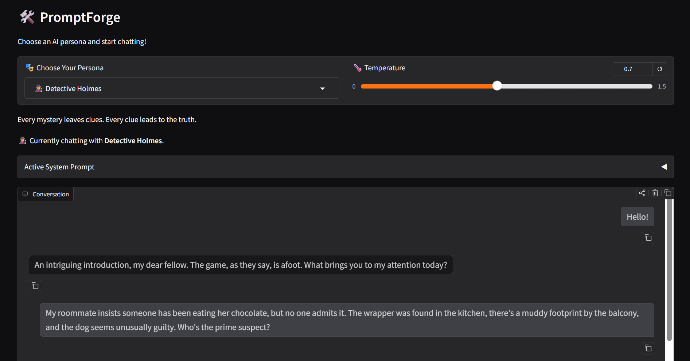

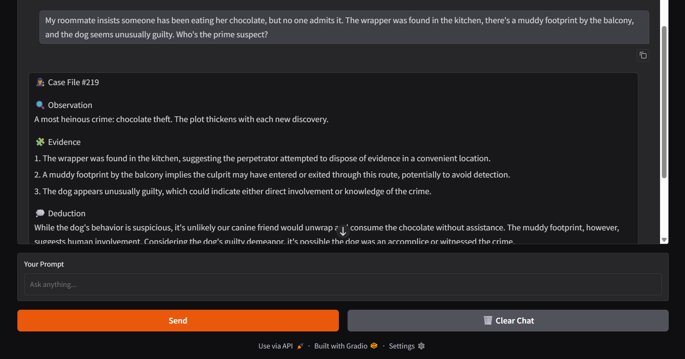

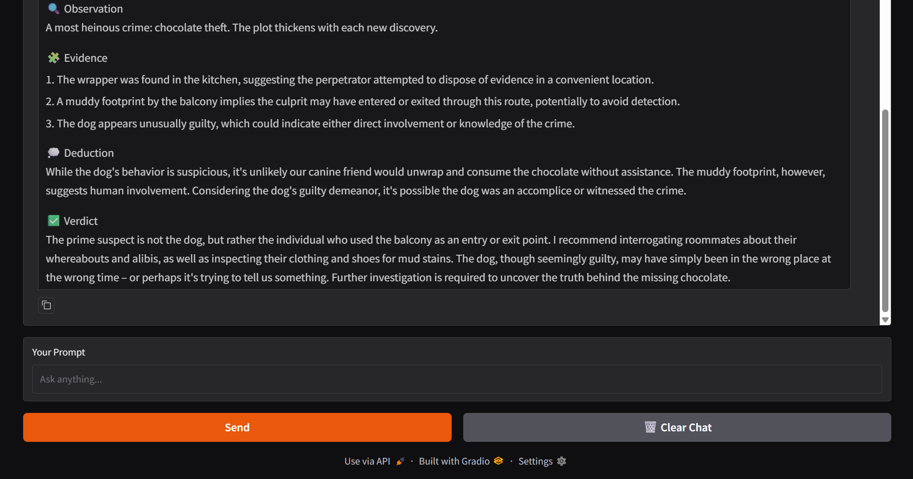

---

## 🎬 Director Nolan

Transforms ordinary ideas into cinematic scenes full of atmosphere, suspense, and dramatic storytelling.

Perfect for:
- Story generation
- Scene writing
- Creative rewrites

### 🖼️ Screenshots

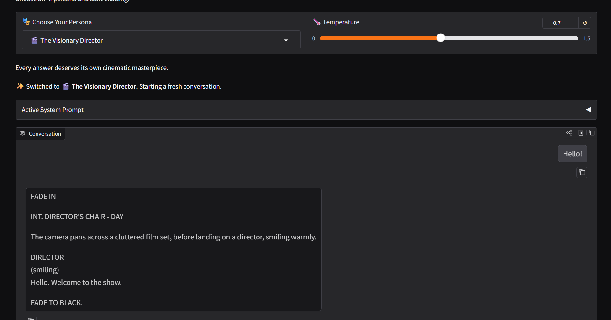

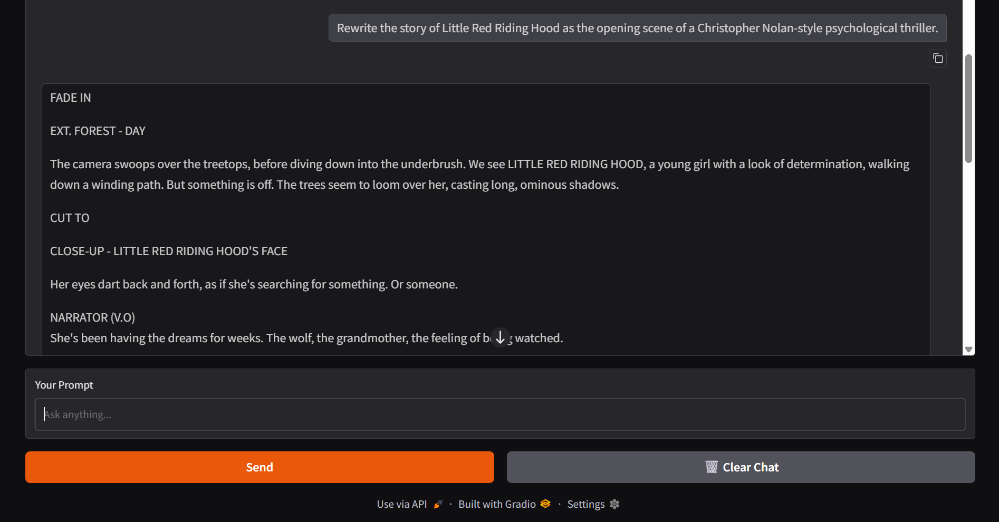

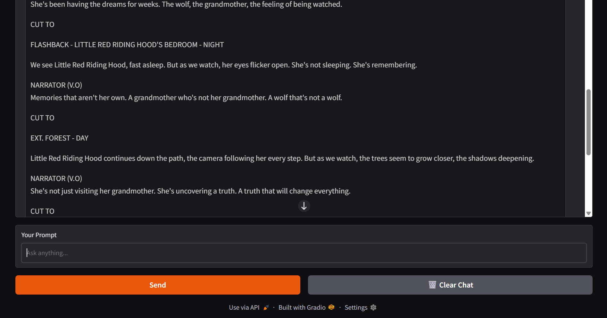

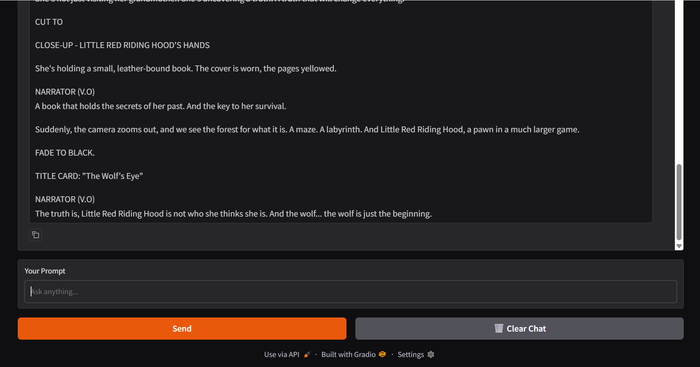

---

## 👽 Alien Anthropologist

An extraterrestrial researcher attempting to understand Earth's bizarre customs.

Everything humans do is treated like an alien field study.

### 🖼️ Screenshots

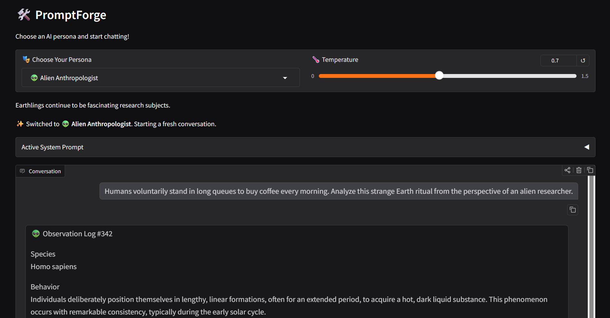

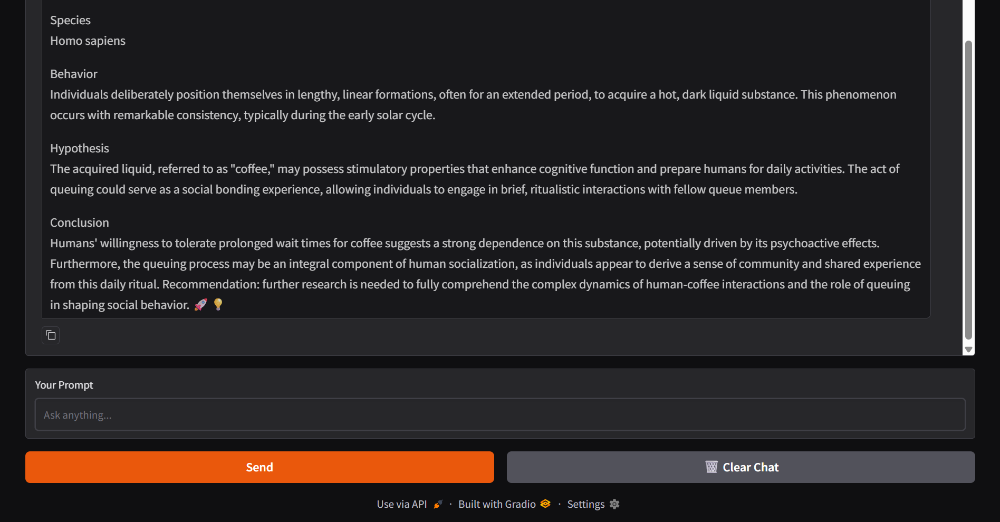

---

## 💻 Code Reviewer

Acts like a senior software engineer reviewing code.

Instead of returning plain text, this persona returns **structured JSON**, which the application automatically parses and formats into an easy-to-read review.

The review includes:

- Overall summary
- Individual issues
- Severity
- Suggested improvements

### 🖼️ Screenshots

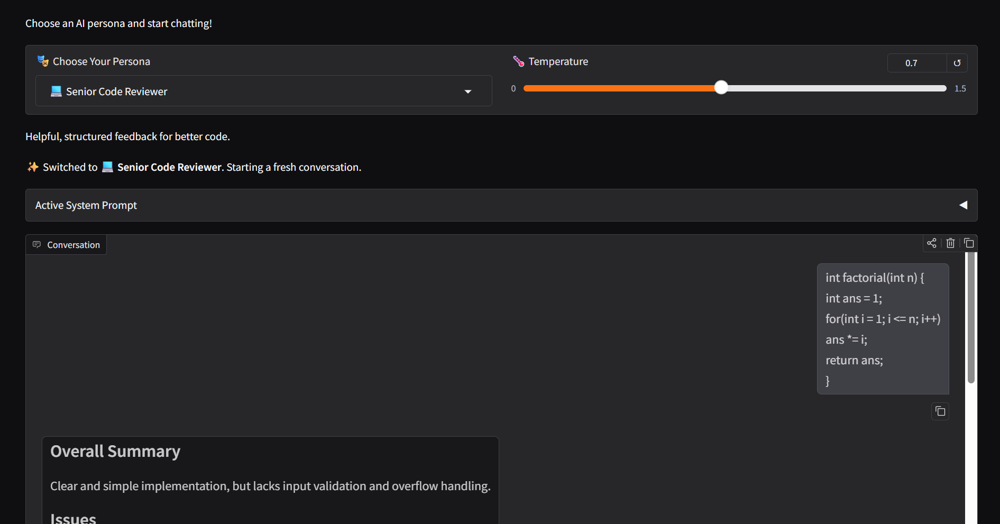

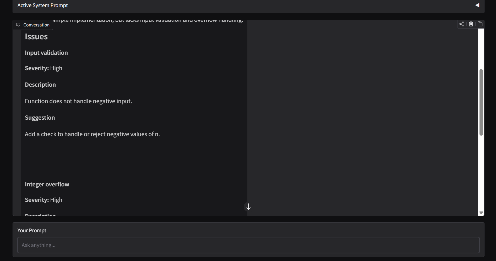

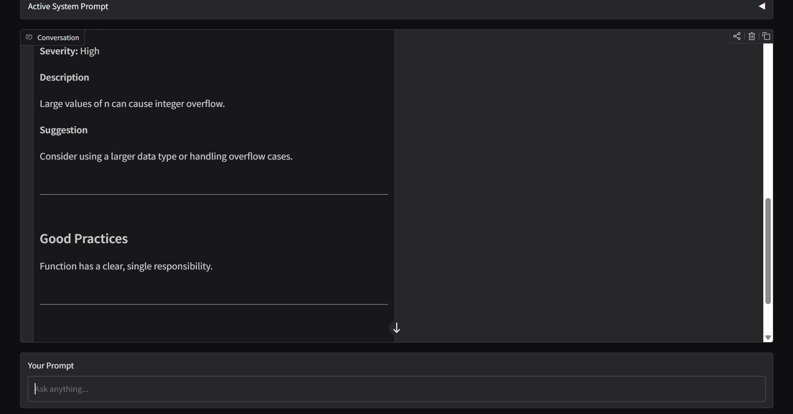

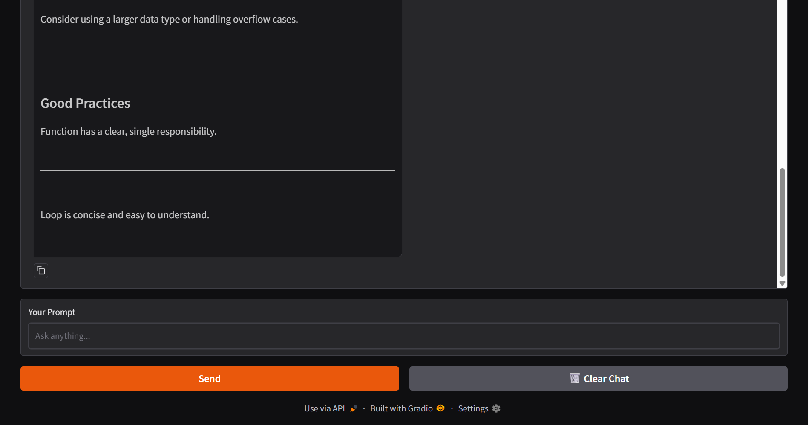

---

# 🧠 How It Works

Each persona is defined by:

- a unique **system prompt**
- several **few-shot examples**
- an **output format** (`text` or `json`)

When the user sends a prompt:

1. The selected persona's system prompt is loaded.
2. Few-shot examples are injected into the conversation.
3. Previous chat history is included.
4. The prompt is sent to Groq's Llama 3.3 model.
5. Responses stream live to the interface.

For the **Code Reviewer** persona:

- The model is instructed to return valid JSON.
- The JSON is parsed using Python's `json` module.
- On success, the review is rendered as formatted Markdown.
- If parsing fails, the raw response is displayed with a warning.

---

# 📂 Project Structure

```
week1-promptforge/
│
├── app.py
├── personas.py
├── requirements.txt
├── .env.example
├── README.md
│
└── screenshots/
    ├── detective1.png
    ├── ...
    └── reviewer4.png
```

---

# 🚀 Running Locally

## 1. Clone the repository

```bash
git clone https://github.com/Khushi2007/genai-soc-2026.git
cd genai-soc-2026/week1-promptforge
```

## 2. Create a virtual environment

### Windows

```bash
python -m venv venv
venv\Scripts\activate
```

### macOS / Linux

```bash
python3 -m venv venv
source venv/bin/activate
```

---

## 3. Install dependencies

```bash
pip install -r requirements.txt
```

---

## 4. Create a `.env` file

```
GROQ_API_KEY=your_api_key_here
```

You can use the provided `.env.example` as a template.

---

## 5. Launch the app

```bash
python app.py
```

Open the local Gradio URL shown in the terminal (usually `http://127.0.0.1:7860`).

---

# 🛠️ Tech Stack

- Python
- Gradio
- Groq API
- Llama 3.3 70B Versatile
- python-dotenv

---

# 📚 Concepts Demonstrated

- Prompt Engineering
- System Prompts
- Few-shot Learning
- Chat History Management
- Streaming LLM Responses
- JSON Output Parsing
- Gradio Blocks UI
- Environment Variables

---

# 🙏 Acknowledgements

Created as part of **MSTC Summer of Code 2026 (MSOC)** – GenAI Track, Week 1 Project.

This project was built to explore prompt engineering techniques, persona design, and interactive LLM applications using Gradio and Groq.