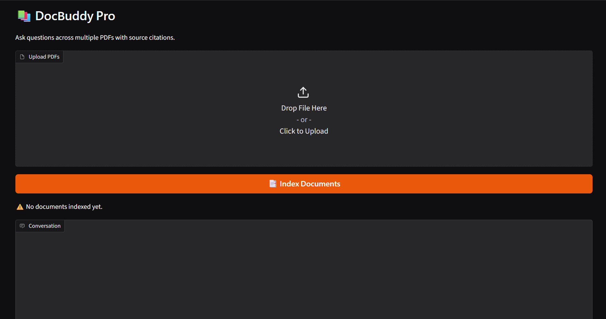
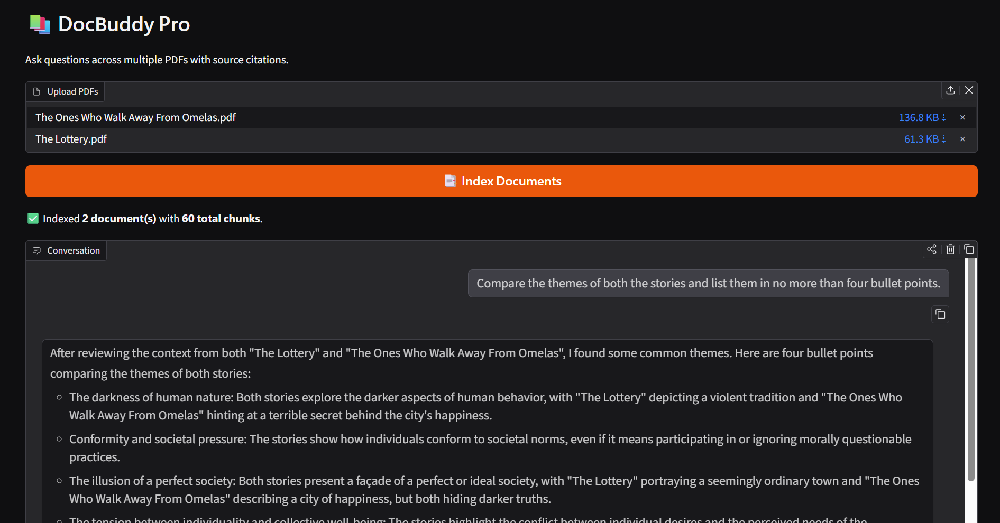
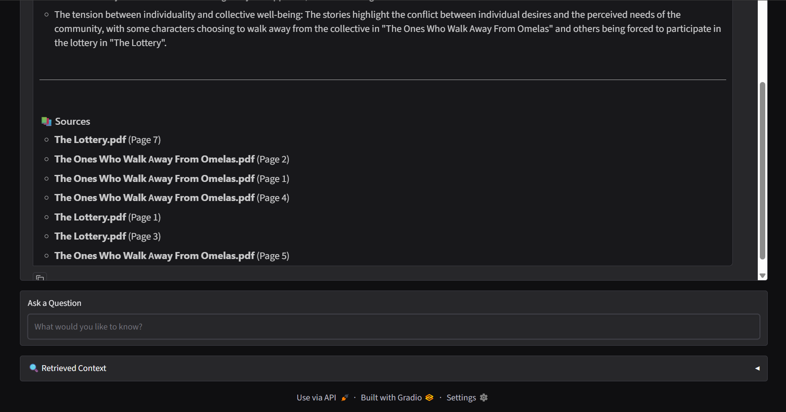

# 📚 DocBuddy Pro

A Retrieval-Augmented Generation (RAG) chatbot that answers questions across multiple PDF documents with source citations.

Built for **Week 2** of **Microsoft Summer of Code (MSOC) 2026 – GenAI Track**.

---

## ✨ Features

- 📄 Upload multiple PDF documents
- 🔍 Semantic search using vector embeddings
- 🤖 Grounded answers generated with Groq Llama 3.3 70B
- 📚 Automatic source citations (document + page number)
- 🧠 Conversation memory for follow-up questions
- 📖 Expandable panel showing the exact retrieved chunks used for each answer
- 💾 Persistent Chroma vector database (documents remain indexed between sessions)

---

## Screenshots

### Main Application



---

### Question Answering with Source Citations





---

# What is RAG?

Retrieval-Augmented Generation (RAG) combines semantic search with a language model. Instead of relying only on what the model already knows, it first retrieves the most relevant pieces of the uploaded documents and then generates an answer using only that information.

This makes the responses more accurate, grounded, and explainable because every answer can be traced back to specific document sources.

---

# How it Works

1. Upload one or more PDF documents.
2. The PDFs are split into smaller text chunks.
3. Each chunk is converted into a vector embedding using a Sentence Transformer model.
4. The embeddings are stored inside a persistent Chroma vector database.
5. When a question is asked:
   - the most relevant chunks are retrieved,
   - those chunks are sent to the LLM,
   - the answer is generated using only the retrieved context,
   - source citations are appended automatically.
6. The retrieved chunks are displayed so users can see exactly what information the model used.

---

# Tech Stack

- Python
- Gradio
- LangChain
- ChromaDB
- Sentence Transformers
- Groq API
- PyPDF

---

# Installation

Clone the repository and navigate into the project folder.

```bash
git clone <your-repository-url>
cd genai-soc-2026/week2-docbuddy
```

Create a virtual environment.

```bash
python -m venv venv
```

Activate it.

### Windows

```bash
venv\Scripts\activate
```

### macOS / Linux

```bash
source venv/bin/activate
```

Install the dependencies.

```bash
pip install -r requirements.txt
```

Create a `.env` file using `.env.example` and add your Groq API key.

```env
GROQ_API_KEY=your_api_key_here
```

Run the application.

```bash
python app.py
```

The Gradio interface will launch locally in your browser.

---

# Testing

## Multi-document Retrieval

Uploaded two different PDF documents and successfully retrieved information from each independently.

✅ Questions about Document A cited only Document A.

✅ Questions about Document B cited only Document B.

✅ Follow-up questions were answered using conversational history.

---

## Grounded Responses

Questions whose answers existed inside the uploaded documents produced accurate answers with page citations.

Example:

> Who is the author of *The Ones Who Walk Away From Omelas?*

The application correctly answered:

> Ursula K. Le Guin

along with citations to the relevant pages.

---

## Hallucination Prevention

Questions that were not supported by the retrieved context returned:

> "I don't have that information in the uploaded documents."

instead of inventing an answer.

---

# What Worked Well

- Multi-document semantic retrieval worked reliably.
- Persistent Chroma storage eliminated unnecessary re-indexing.
- Source citations made every answer transparent.
- Showing the retrieved chunks made it much easier to understand how RAG works internally.
- Conversation history allowed natural follow-up questions.

---

# What I'd Improve

Given more time, I would like to add:

- Streaming responses
- Per-document filtering
- Chunk analytics dashboard
- Hybrid (keyword + semantic) retrieval
- Better reranking for large document collections
- Support for additional document formats such as DOCX and Markdown

---

# Project Structure

```
week2-docbuddy/
│
├── app.py
├── rag.py
├── prompts.py
├── requirements.txt
├── .env.example
├── .gitignore
├── README.md
├── chroma_store/
└── screenshots/
```

---

Built as part of the **Microsoft Summer of Code (MSOC) 2026 – GenAI Track**.