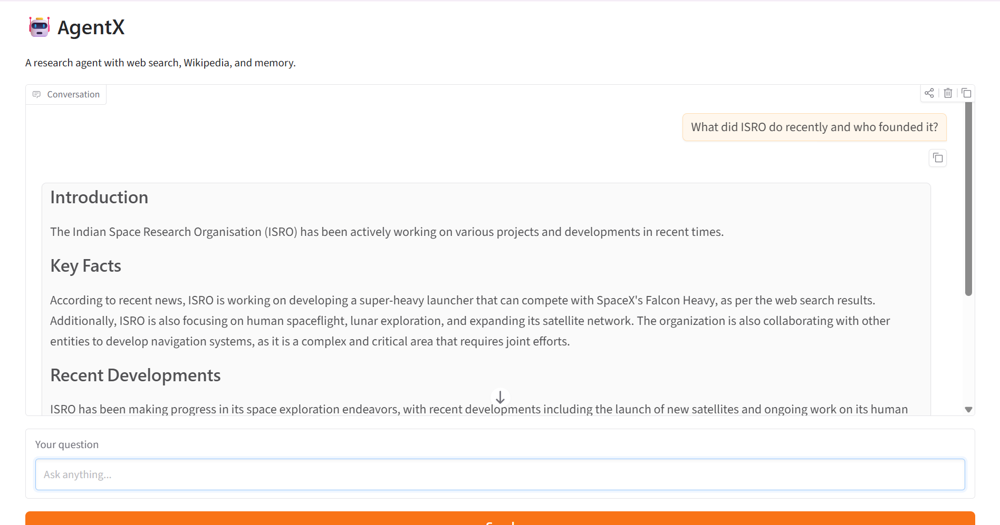
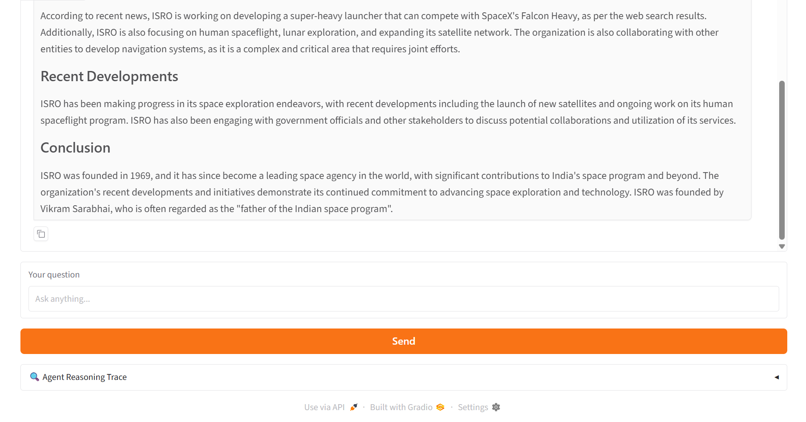
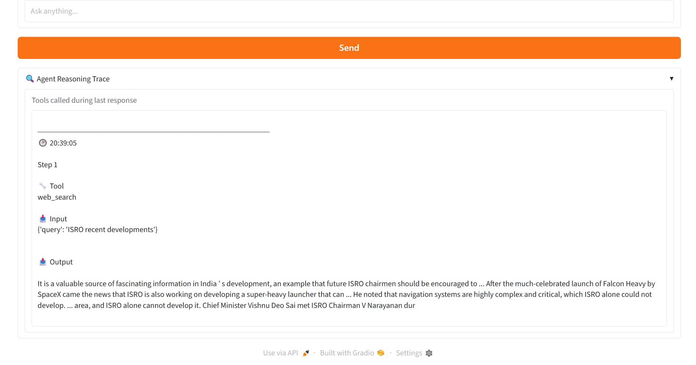
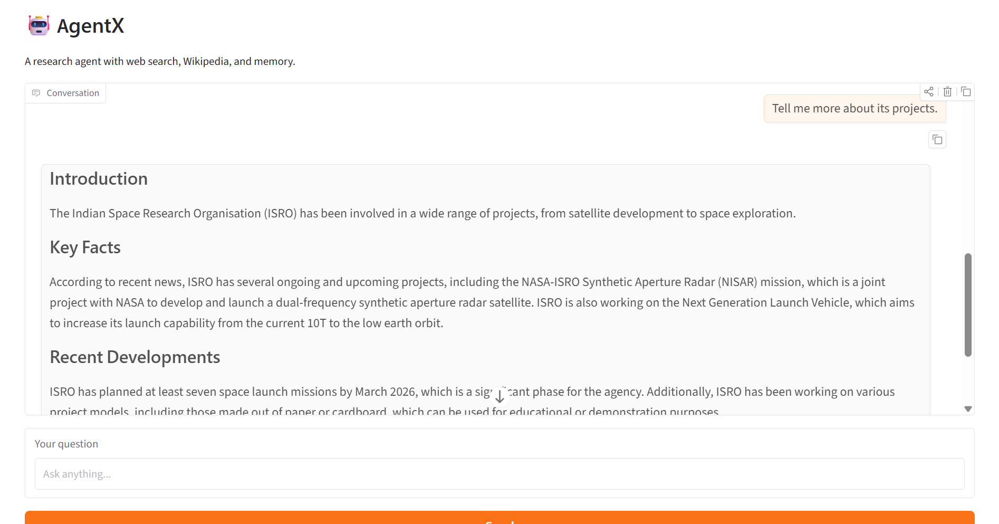
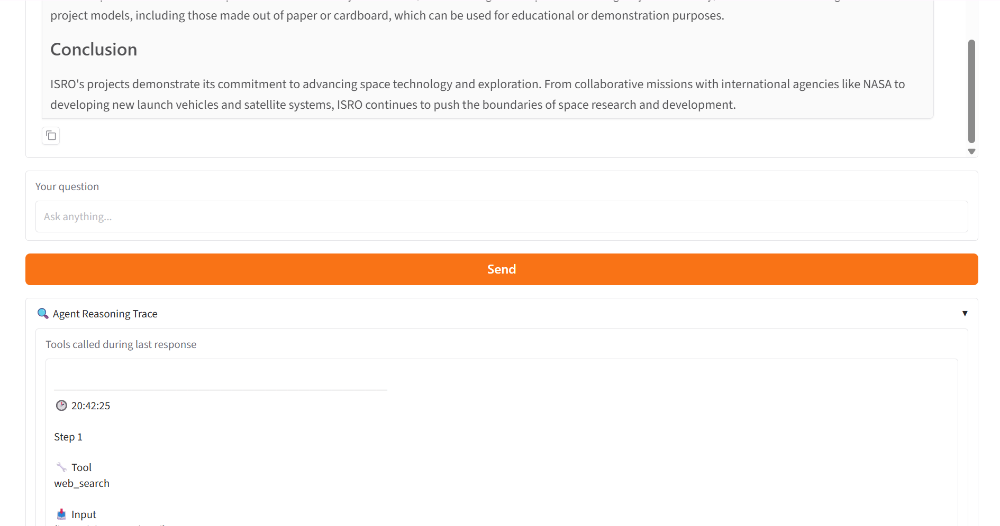

# 🤖 AgentX — Research Agent with Memory & Visible Reasoning

AgentX is an AI-powered research assistant built using **LangChain**, **LangGraph**, and **Groq's Llama 3.3 70B** model. It can answer questions using live web search and Wikipedia, remembers previous conversations, and exposes its reasoning process by displaying every tool call made before generating an answer.

The goal of this project was to build an agent that doesn't simply answer questions—it explains *how* it arrived at those answers.

---

## Features

- 🔍 Live web search using DuckDuckGo
- 📚 Wikipedia integration for factual and historical knowledge
- 🧠 Conversation memory across multiple turns
- 🔎 Visible reasoning trace showing every tool call
- ⚡ Powered by Groq's Llama 3.3 70B model
- 🎨 Interactive Gradio interface

---

## Project Structure

```
week3-agentx/
│
├── app.py
├── agent.py
├── requirements.txt
├── .env.example
├── README.md
├── .gitignore
└── screenshots/
```

---

## Screenshots

### Main Interface





---

### Research with Reasoning Trace

The reasoning trace shows exactly which tools the agent called before producing its final response.



---

### Conversation Memory

The agent remembers previous messages, allowing follow-up questions without repeating context.





---

# Tools Used

### 🌐 DuckDuckGo Search

Used whenever the user asks about:

- current events
- recent news
- live information
- products and companies
- anything time-sensitive

This provides the agent with up-to-date information beyond its training data.

---

### 📖 Wikipedia

Used for:

- biographies
- historical events
- scientific concepts
- definitions
- background knowledge

This serves as the primary source for stable factual information.

---

### 📅 Current Date Tool

A custom LangChain tool that returns today's date.

It helps the agent correctly interpret prompts such as:

- "today"
- "latest"
- "this year"
- "current"

and decide whether a live web search is required.

---

## Conversation Memory

AgentX uses **LangGraph's MemorySaver** checkpointing system.

Each browser session receives a unique conversation thread, allowing the agent to understand follow-up questions such as:

> Tell me more.

> Compare the second point.

> Explain that further.

without requiring the user to repeat previous context.

---

## Visible Reasoning

Every time the agent calls a tool, the application records:

- tool name
- tool input
- tool output
- timestamp

These are displayed inside the **🔍 Agent Reasoning Trace** panel, making the reasoning process transparent and easier to understand.

---

## Installation

Clone the repository:

```bash
git clone https://github.com/Khushi2007/genai-soc-2026.git
cd week3-agentx
```

Create a virtual environment:

```bash
python -m venv venv
```

Activate it.

Windows:

```bash
venv\Scripts\activate
```

Linux/macOS:

```bash
source venv/bin/activate
```

Install dependencies:

```bash
pip install -r requirements.txt
```

Create a `.env` file:

```env
GROQ_API_KEY=your_api_key_here
```

Run the application:

```bash
python app.py
```

---

## Testing

The following scenarios were tested:

### ✅ Current Events

Asked about recent developments in technology and verified that DuckDuckGo Search was used.

### ✅ Historical Knowledge

Asked historical questions such as notable scientists and confirmed Wikipedia retrieval.

### ✅ Multi-step Research

Asked questions requiring both Wikipedia and DuckDuckGo to produce a combined answer.

### ✅ Conversation Memory

Asked follow-up questions like:

> Tell me more.

> Compare them.

and verified that previous conversation context was remembered.

### ✅ Reasoning Trace

Confirmed that every external tool invocation appears inside the reasoning trace panel.

---

## Technologies Used

- Python
- LangChain
- LangGraph
- Groq API
- DuckDuckGo Search
- Wikipedia API
- Gradio

---

# What I Learned

This project helped me understand how modern AI agents differ from traditional chatbots.

Unlike a standard LLM, an agent can decide when external tools are needed, call them dynamically, and use conversation memory to answer follow-up questions naturally. Building the reasoning trace also made it much easier to understand how an agent plans and executes each response.

---

# What I'd Improve

Although the agent performs well, there are still several areas for improvement:

- Improve tool selection so the model is less likely to answer from its own knowledge instead of calling an available tool.
- Stream responses token-by-token for a smoother user experience.
- Display tool outputs in a richer, structured format instead of plain text.
- Add more research tools (such as ArXiv, Tavily, or Google Search) for broader coverage.
- Allow exporting conversations and reasoning traces for later reference.
- Improve error recovery when external tools fail or return incomplete results.

---

## Environment Variables

Create a `.env` file:

```env
GROQ_API_KEY=your_groq_api_key
```

An example template is included in `.env.example`.

---

## License

Created as part of **MSTC Summer of Code 2026 — Week 3 Project**.