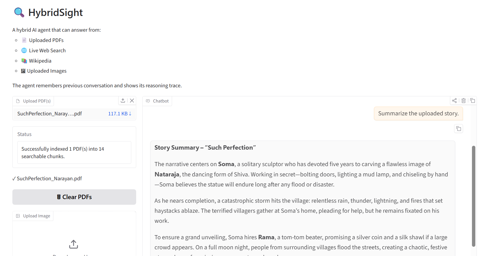
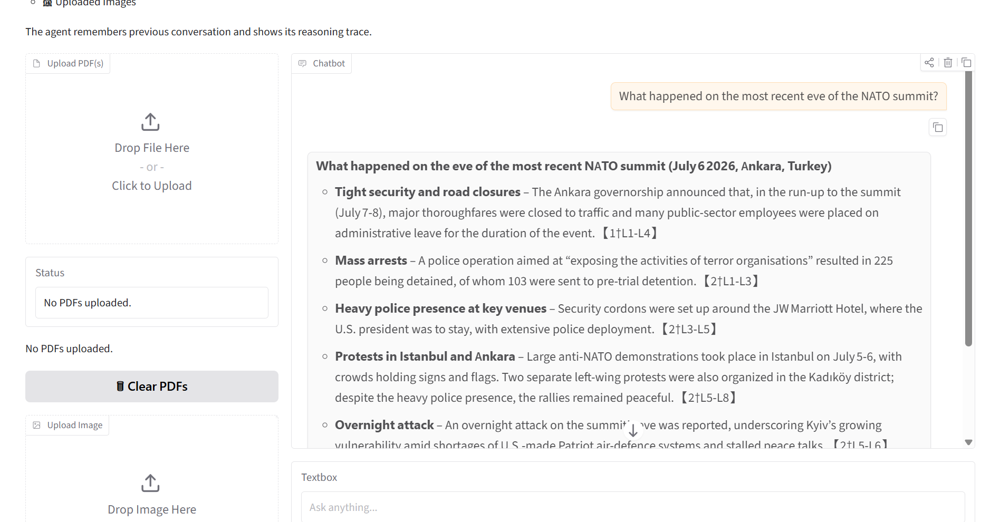
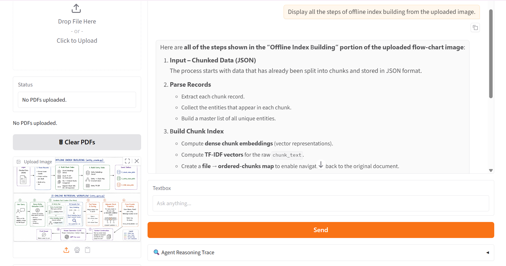
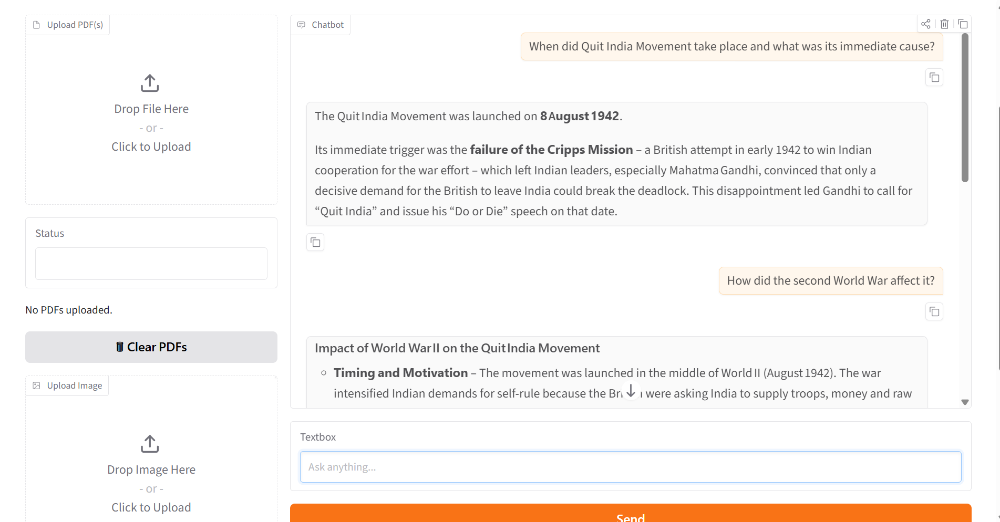
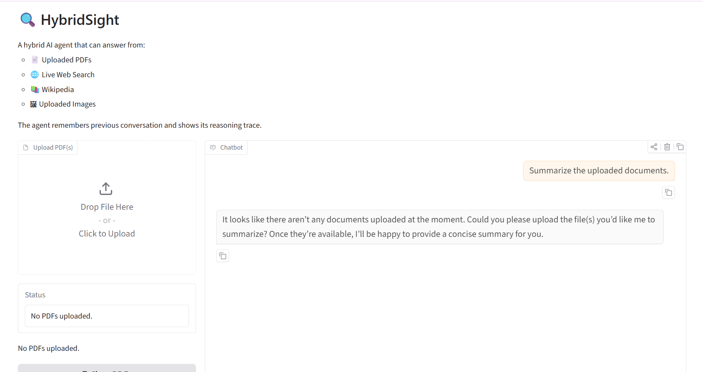

# 🔍 HybridSight

HybridSight is a hybrid multimodal AI assistant built with **LangGraph**, **LangChain**, **Gradio**, **ChromaDB**, and **Groq**. It intelligently routes user queries to the appropriate tool, allowing a single conversation to combine **Retrieval-Augmented Generation (RAG)**, **live web search**, **Wikipedia**, and **image understanding**.

## ✨ Features

* 📄 Retrieval-Augmented Generation (RAG) over uploaded PDFs
* 🌐 Live web search using DuckDuckGo
* 📚 Wikipedia-based factual lookup
* 🖼️ Vision-based image understanding
* 🧠 Multi-turn conversation memory
* 🔍 Transparent reasoning traces showing every tool call

---

# 🛠 Tech Stack

* Python
* LangChain
* LangGraph
* ChromaDB
* Sentence Transformers
* Groq (Llama 3.3 & Meta Llama 4 Scout)
* DuckDuckGo Search
* Wikipedia
* Gradio

---

# 🚀 Setup

## 1. Clone the repository

```bash
git clone https://github.com/Khushi2007/genai-soc-2026.git
cd week5-hybridsight
```

## 2. Install dependencies

```bash
pip install -r requirements.txt
```

## 3. Create a `.env` file

Copy `.env.example` and add your Groq API key.

```text
GROQ_API_KEY=your_api_key_here
```

## 4. Run the application

```bash
python app.py
```

---

# 📂 Project Structure

```text
week5-hybridsight/
│
├── agent.py
├── app.py
├── tools_rag.py
├── tools_vision.py
├── chroma_store/
├── screenshots/
├── requirements.txt
├── .env.example
└── README.md
```

---

# 🧪 Test Cases

## 1. Question Answerable Only from an Uploaded PDF

The agent retrieves relevant chunks from the indexed PDF using the **search_documents** tool.



---

## 2. Current Event from This Week

The agent routes the query to **DuckDuckGo Search** and answers using live web information.



---

## 3. Uploaded Image Analysis

The agent analyzes the uploaded image using the **describe_image** vision tool.



---

## 4. General Knowledge Question

The agent retrieves factual information using the **Wikipedia** tool.



---

## 5. Question Before Any PDF is Uploaded

The application gracefully informs the user that no documents have been uploaded instead of producing an error.



---

# 🔍 Reasoning Trace

Every response includes an expandable **Reasoning Trace** that records:

* Tool selected
* Tool input
* Tool output

This makes the agent's decision-making process transparent and easy to inspect.

---

# ⚠️ Limitations

* Web search quality depends on DuckDuckGo search results.
* Image understanding depends on the availability of the configured vision model.
* Uploading new PDFs replaces the previously indexed document collection.

---

# 🚀 What I'd Improve

If I had more time, I would:

* Support multiple PDF collections instead of replacing the existing index.
* Display retrieved document chunks alongside generated answers.
* Stream responses token-by-token for a smoother user experience.
* Add OCR support for scanned PDFs.
* Improve multimodal reasoning by combining information from PDFs, images, and live web search in a single response.
* Add clickable citations linking directly to retrieved document pages and web sources.

---

## ✅ Week 5 Requirements Checklist

* ✔ RAG over uploaded PDFs
* ✔ Live web search
* ✔ Wikipedia knowledge retrieval
* ✔ Vision tool for uploaded images
* ✔ Conversation memory
* ✔ Tool routing with LangGraph
* ✔ Visible reasoning trace
* ✔ Graceful handling of missing PDFs/images
* ✔ Gradio interface
