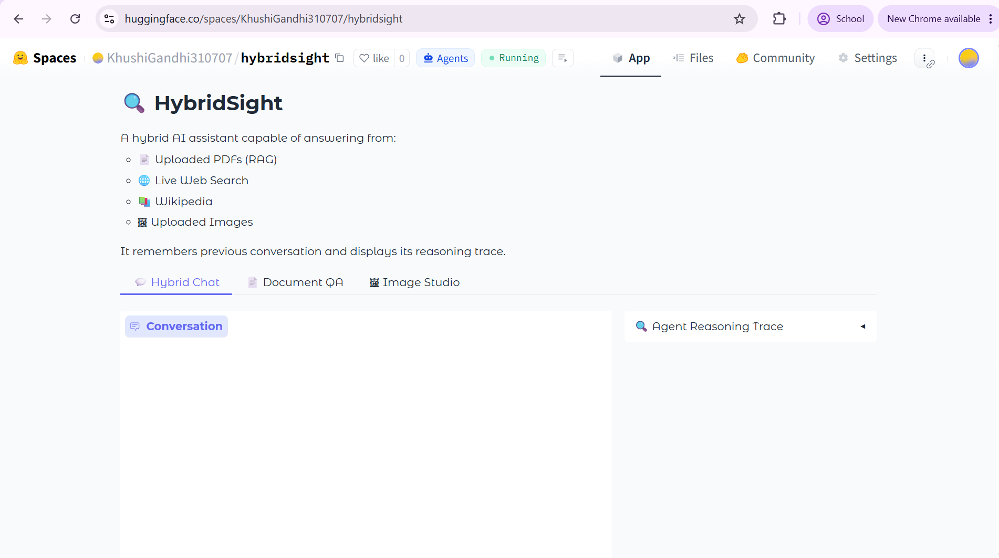

# 🔍 HybridSight

HybridSight is a hybrid AI research assistant that combines **Retrieval-Augmented Generation (RAG)**, **live web search**, **Wikipedia search**, and **image understanding** into a single conversational agent built with **LangGraph** and **Gradio**.

---

## Features

- 📄 Chat with uploaded PDF documents using RAG + ChromaDB
- 🌐 Answer current events using live web search
- 📚 Answer factual questions using Wikipedia
- 🖼️ Analyze uploaded images with a vision model
- 🧠 Multi-turn conversational memory
- 🔍 Agent reasoning trace showing tool usage
- 🎨 Professional multi-tab Gradio interface
- ⏳ Progress bar while indexing PDFs
- 🛡️ Graceful error handling for missing documents, images, and API failures

---

## Tech Stack

- Python
- Gradio
- LangGraph
- LangChain
- ChromaDB
- HuggingFace Embeddings
- Groq LLM
- DuckDuckGo Search
- Wikipedia API

---

## Project Structure

```
HybridSight/
│
├── agent.py
├── app.py
├── tools_rag.py
├── tools_web.py
├── tools_wikipedia.py
├── tools_vision.py
├── safe_call.py
├── requirements.txt
├── .env.example
├── chroma_store/
└── screenshots/
```

---

## Local Setup

### 1. Clone the repository

```bash
git clone https://github.com/Khushi2007/genai-soc-2026.git
cd HybridSight
```

### 2. Install dependencies

```bash
pip install -r requirements.txt
```

### 3. Create a `.env` file

```env
GROQ_API_KEY=your_groq_api_key_here
```

### 4. Run the application

```bash
python app.py
```

---

# Live Demo

> **Hugging Face Spaces:** *https://huggingface.co/spaces/KhushiGandhi310707/hybridsight*

---

# Application Screenshot



---

# Test Scenarios

| # | Scenario | Expected Tool | Screenshot |
|---|----------|---------------|------------|
| 1 | Ask a question answerable only from an uploaded PDF | `search_documents` |  |
| 2 | Ask about a current event from this week | `web_search` |  |
| 3 | Upload an image and ask *"What's in this picture?"* | `describe_image` |  |
| 4 | Ask a general knowledge question (historical fact) | `wikipedia_search` |  |
| 5 | Ask a question before uploading any PDF | Graceful "No documents uploaded" response |  |

---

# Example Capabilities

### 📄 Document QA

- Summarize uploaded PDFs
- Answer questions from reports
- Compare multiple documents
- Cite document pages

### 🌐 Live Web Search

- Current events
- Recent technology news
- Sports updates
- Latest developments

### 📚 Wikipedia Search

- Historical events
- Scientific concepts
- Organizations
- Biographies

### 🖼️ Vision

- Describe uploaded images
- Explain diagrams
- Read charts
- Analyze screenshots

---

# Future Improvements

- Streaming responses
- Source hyperlinks
- Multi-image support
- Persistent chat history
- Additional search providers
- Document citation highlighting

---

# License

This project was developed as part of the **MSTC GenAI Summer of Code 2026** learning program.